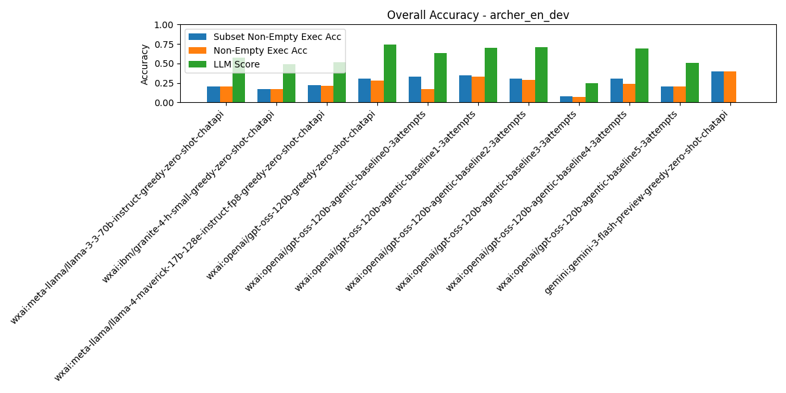

# Summary Results

## Overall Multi-Model Accuracy Results

_Results sorted by `subset_non_empty_execution_accuracy` (higher is better)_

| Rank | Model / Pipeline | Execution Acc | Non-Empty Exec Acc | Subset Non-Empty Exec Acc | BIRD Exec Acc | LLM Judge Score | Parsable SQL | SQL Syntactic Match | Eval Err | DF Err | Avg Tokens/Q | Avg Inference (ms) | Avg Execution (ms) | Total Tokens | Total Inference (ms) | Total Execution (ms) | #Records | #Predictions | #Evaluated | #Correct Non-Empty Exec Acc | #Correct Subset Non-Empty Exec Acc | #Correct As Per LLM Judge |
| --- | --- | --- | --- | --- | --- | --- | --- | --- | --- | --- | --- | --- | --- | --- | --- | --- | --- | --- | --- | --- | --- | --- |
| 1 | gemini:gemini-3-flash-preview-greedy-zero-shot-chatapi | 0.40 | 0.39 | 0.39 | 0.41 | N/A | 0.98 | 0.00 | 0.00 | 0.05 | 6193.31 | 30577.30 | 179.96 | 644104 | 3180039.23 | 18716.03 | 104 | 104 | 104 | 41 | 41 | N/A |
| 2 | wxai:openai/gpt-oss-120b-agentic-baseline1-3attempts | 0.33 | 0.33 | 0.35 | 0.34 | 0.70 | 1.00 | 0.00 | 0.00 | 0.04 | 2033.98 | 10503.69 | 6.31 | 211534 | 1092383.76 | 656.04 | 104 | 104 | 104 | 34 | 36 | 73 |
| 3 | wxai:openai/gpt-oss-120b-agentic-baseline0-3attempts | 0.18 | 0.17 | 0.33 | 0.19 | 0.63 | 1.00 | 0.00 | 0.00 | 0.06 | 2245.66 | 11781.76 | 6.48 | 233549 | 1225303.3 | 673.55 | 104 | 104 | 104 | 18 | 34 | 66 |
| 4 | wxai:openai/gpt-oss-120b-greedy-zero-shot-chatapi | 0.30 | 0.28 | 0.31 | 0.31 | 0.74 | 1.00 | 0.00 | 0.00 | 0.13 | 1629.68 | 7191.54 | 37.32 | 169487 | 747919.72 | 3880.78 | 104 | 104 | 104 | 29 | 32 | 77 |
| 5 | wxai:openai/gpt-oss-120b-agentic-baseline2-3attempts | 0.33 | 0.29 | 0.31 | 0.35 | 0.71 | 1.00 | 0.00 | 0.00 | 0.01 | 1808.19 | 8777.84 | 6.69 | 188052 | 912895.08 | 696.0 | 104 | 104 | 104 | 30 | 32 | 74 |
| 6 | wxai:openai/gpt-oss-120b-agentic-baseline4-3attempts | 0.24 | 0.24 | 0.31 | 0.24 | 0.69 | 0.81 | 0.00 | 0.00 | 0.00 | 3566.39 | 97801.63 | 34912.71 | 370905 | 10171369.23 | 3630922.1 | 104 | 104 | 84 | 25 | 32 | 72 |
| 7 | wxai:meta-llama/llama-4-maverick-17b-128e-instruct-fp8-greedy-zero-shot-chatapi | 0.23 | 0.21 | 0.22 | 0.24 | 0.52 | 1.00 | 0.00 | 0.00 | 0.06 | 1134.86 | 3664.11 | 42.27 | 118025 | 381067.68 | 4396.29 | 104 | 104 | 104 | 22 | 23 | 54 |
| 8 | wxai:meta-llama/llama-3-3-70b-instruct-greedy-zero-shot-chatapi | 0.20 | 0.20 | 0.20 | 0.20 | 0.58 | 1.00 | 0.00 | 0.00 | 0.03 | 1087.05 | 5366.80 | 34.19 | 113053 | 558147.12 | 3555.27 | 104 | 104 | 104 | 21 | 21 | 60 |
| 9 | wxai:openai/gpt-oss-120b-agentic-baseline5-3attempts | 0.21 | 0.20 | 0.20 | 0.21 | 0.51 | 0.70 | 0.00 | 0.00 | 0.04 | 8109.88 | 135190.70 | 12944.26 | 843427 | 14059833.29 | 1346203.08 | 104 | 104 | 73 | 21 | 21 | 53 |
| 10 | wxai:ibm/granite-4-h-small-greedy-zero-shot-chatapi | 0.17 | 0.17 | 0.17 | 0.17 | 0.49 | 1.00 | 0.00 | 0.00 | 0.08 | 1063.48 | 5281.20 | 40.68 | 110602 | 549244.82 | 4230.48 | 104 | 104 | 104 | 18 | 18 | 51 |
| 11 | wxai:openai/gpt-oss-120b-agentic-baseline3-3attempts | 0.08 | 0.07 | 0.08 | 0.08 | 0.25 | 0.98 | 0.00 | 0.00 | 0.70 | 4570.28 | 46927.94 | 5.95 | 475309 | 4880505.96 | 618.41 | 104 | 104 | 104 | 7 | 8 | 26 |

