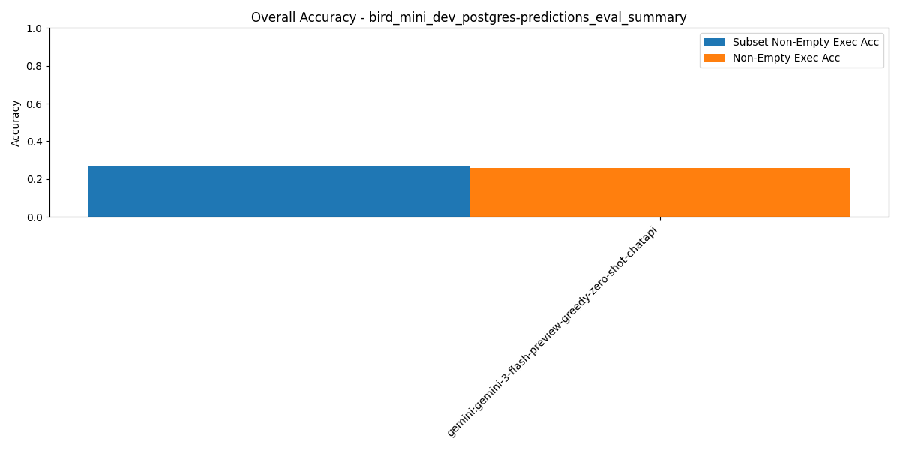

# Summary Results

## Overall Multi-Model Accuracy Results

_Results sorted by `subset_non_empty_execution_accuracy` (higher is better)_

| Rank | Model / Pipeline | Execution Acc | Non-Empty Exec Acc | Subset Non-Empty Exec Acc | BIRD Exec Acc | LLM Judge Score | Parsable SQL | SQL Syntactic Match | Eval Err | DF Err | Avg Tokens/Q | Avg Inference (ms) | Avg Execution (ms) | Total Tokens | Total Inference (ms) | Total Execution (ms) | #Records | #Predictions | #Evaluated | #Correct Non-Empty Exec Acc | #Correct Subset Non-Empty Exec Acc | #Correct As Per LLM Judge |
| --- | --- | --- | --- | --- | --- | --- | --- | --- | --- | --- | --- | --- | --- | --- | --- | --- | --- | --- | --- | --- | --- | --- |
| 1 | wxai:openai/gpt-oss-120b-greedy-zero-shot-chatapi | 0.45 | 0.45 | 0.51 | 0.47 | 0.86 | 1.00 | 0.04 | 0.00 | 0.03 | 8760.12 | 5758.15 | 356.71 | 4380060 | 2879074.43 | 178353.89 | 500 | 500 | 499 | 225 | 254 | 432 |
| 2 | wxai:meta-llama/llama-3-3-70b-instruct-greedy-zero-shot-chatapi | 0.41 | 0.41 | 0.44 | 0.43 | 0.72 | 1.00 | 0.06 | 0.00 | 0.21 | 8288.53 | 8061.44 | 256.69 | 4144266 | 4030721.52 | 128347.37 | 500 | 500 | 500 | 204 | 218 | 360 |
| 3 | wxai:openai/gpt-oss-120b-agentic-baseline1-3attempts | 0.35 | 0.35 | 0.41 | 0.38 | 0.80 | 1.00 | 0.04 | 0.00 | 0.01 | 9165.86 | 6702.31 | 240.04 | 4582932 | 3351156.83 | 120019.02 | 500 | 500 | 499 | 173 | 207 | 401 |
| 4 | wxai:openai/gpt-oss-120b-agentic-baseline2-3attempts | 0.35 | 0.34 | 0.39 | 0.38 | 0.82 | 1.00 | 0.02 | 0.00 | 0.00 | 9087.37 | 14168.63 | 280.03 | 4543686 | 7084316.59 | 140013.41 | 500 | 500 | 499 | 171 | 196 | 410 |
| 5 | wxai:openai/gpt-oss-120b-agentic-baseline0-3attempts | 0.29 | 0.29 | 0.37 | 0.32 | 0.79 | 1.00 | 0.02 | 0.00 | 0.01 | 9787.48 | 7724.49 | 239.90 | 4893741 | 3862244.17 | 119951.02 | 500 | 500 | 498 | 144 | 185 | 395 |
| 6 | wxai:openai/gpt-oss-120b-agentic-baseline4-3attempts | 0.29 | 0.29 | 0.37 | 0.32 | 0.82 | 0.95 | 0.04 | 0.00 | 0.03 | 23740.99 | 90984.40 | 10991.48 | 11870494 | 45492200.2 | 5495740.41 | 500 | 500 | 475 | 145 | 185 | 409 |
| 7 | wxai:meta-llama/llama-4-maverick-17b-128e-instruct-fp8-greedy-zero-shot-chatapi | 0.33 | 0.32 | 0.37 | 0.35 | 0.62 | 1.00 | 0.08 | 0.00 | 0.30 | 8417.81 | 2613.22 | 227.46 | 4208906 | 1306609.41 | 113728.01 | 500 | 500 | 500 | 162 | 183 | 308 |
| 8 | wxai:ibm/granite-4-h-small-greedy-zero-shot-chatapi | 0.32 | 0.32 | 0.34 | 0.34 | 0.62 | 1.00 | 0.05 | 0.00 | 0.25 | 8273.99 | 5565.69 | 233.18 | 4136996 | 2782844.04 | 116590.23 | 500 | 500 | 500 | 159 | 169 | 309 |
| 9 | gemini:gemini-3-flash-preview-greedy-zero-shot-chatapi | 0.26 | 0.26 | 0.27 | 0.27 | N/A | 0.99 | 0.19 | 0.00 | 0.61 | 11511.23 | 14788.35 | 25.24 | 5755617 | 7394173.09 | 12620.76 | 500 | 495 | 500 | 130 | 135 | N/A |
| 10 | wxai:openai/gpt-oss-120b-agentic-baseline5-3attempts | 0.24 | 0.24 | 0.25 | 0.26 | 0.49 | 0.75 | 0.03 | 0.00 | 0.15 | 38646.11 | 209082.93 | 986.41 | 19323055 | 104541463.27 | 493206.98 | 500 | 500 | 376 | 119 | 126 | 247 |
| 11 | wxai:openai/gpt-oss-120b-agentic-baseline3-3attempts | 0.02 | 0.02 | 0.03 | 0.04 | 0.15 | 0.98 | 0.03 | 0.00 | 0.79 | 25779.08 | 74387.21 | 232.61 | 12889541 | 37193607.12 | 116306.44 | 500 | 500 | 499 | 11 | 15 | 73 |

