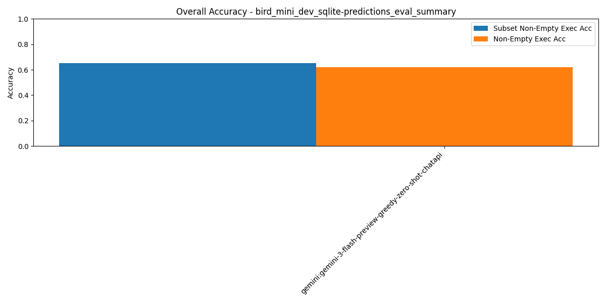

# Summary Results

## Overall Multi-Model Accuracy Results

_Results sorted by `subset_non_empty_execution_accuracy` (higher is better)_

| Rank | Model / Pipeline | Execution Acc | Non-Empty Exec Acc | Subset Non-Empty Exec Acc | BIRD Exec Acc | LLM Judge Score | Parsable SQL | SQL Syntactic Match | Eval Err | DF Err | Avg Tokens/Q | Avg Inference (ms) | Avg Execution (ms) | Total Tokens | Total Inference (ms) | Total Execution (ms) | #Records | #Predictions | #Evaluated | #Correct Non-Empty Exec Acc | #Correct Subset Non-Empty Exec Acc | #Correct As Per LLM Judge |
| --- | --- | --- | --- | --- | --- | --- | --- | --- | --- | --- | --- | --- | --- | --- | --- | --- | --- | --- | --- | --- | --- | --- |
| 1 | gemini:gemini-3-flash-preview-greedy-zero-shot-chatapi | 0.62 | 0.62 | 0.65 | 0.65 | N/A | 0.97 | 0.19 | 0.00 | 0.04 | 11342.20 | 14346.12 | 167.73 | 5671099 | 7173059.67 | 83862.58 | 500 | 493 | 496 | 308 | 323 | N/A |
| 2 | wxai:openai/gpt-oss-120b-greedy-zero-shot-chatapi | 0.51 | 0.51 | 0.57 | 0.53 | 0.90 | 1.00 | 0.05 | 0.00 | 0.01 | 8597.60 | 5374.99 | 155.27 | 4298799 | 2687494.35 | 77635.25 | 500 | 500 | 498 | 255 | 284 | 450 |
| 3 | wxai:meta-llama/llama-4-maverick-17b-128e-instruct-fp8-greedy-zero-shot-chatapi | 0.53 | 0.53 | 0.56 | 0.56 | 0.85 | 1.00 | 0.13 | 0.00 | 0.04 | 8261.04 | 2462.63 | 166.81 | 4130522 | 1231312.75 | 83407.49 | 500 | 500 | 498 | 265 | 281 | 424 |
| 4 | wxai:meta-llama/llama-3-3-70b-instruct-greedy-zero-shot-chatapi | 0.50 | 0.50 | 0.54 | 0.55 | 0.85 | 1.00 | 0.11 | 0.00 | 0.06 | 8130.33 | 7976.21 | 168.95 | 4065163 | 3988106.65 | 84474.2 | 500 | 500 | 498 | 252 | 270 | 423 |
| 5 | wxai:openai/gpt-oss-120b-agentic-baseline1-3attempts | 0.40 | 0.40 | 0.44 | 0.42 | 0.81 | 1.00 | 0.04 | 0.00 | 0.01 | 8816.23 | 6142.69 | 90.35 | 4408113 | 3071344.92 | 45176.67 | 500 | 500 | 498 | 198 | 221 | 403 |
| 6 | wxai:openai/gpt-oss-120b-agentic-baseline2-3attempts | 0.38 | 0.38 | 0.44 | 0.41 | 0.79 | 1.00 | 0.04 | 0.00 | 0.00 | 8809.55 | 5758.73 | 106.47 | 4404773 | 2879362.51 | 53236.95 | 500 | 500 | 498 | 192 | 220 | 396 |
| 7 | wxai:ibm/granite-4-h-small-greedy-zero-shot-chatapi | 0.41 | 0.41 | 0.43 | 0.42 | 0.68 | 1.00 | 0.05 | 0.00 | 0.20 | 8112.76 | 4618.98 | 132.98 | 4056380 | 2309490.68 | 66487.83 | 500 | 500 | 498 | 203 | 217 | 338 |
| 8 | wxai:openai/gpt-oss-120b-agentic-baseline0-3attempts | 0.32 | 0.32 | 0.42 | 0.35 | 0.83 | 0.99 | 0.03 | 0.00 | 0.01 | 9165.13 | 6716.09 | 109.42 | 4582564 | 3358044.83 | 54710.29 | 500 | 500 | 498 | 158 | 208 | 413 |
| 9 | wxai:openai/gpt-oss-120b-agentic-baseline4-3attempts | 0.35 | 0.35 | 0.41 | 0.36 | 0.84 | 0.96 | 0.03 | 0.00 | 0.03 | 23282.17 | 84675.12 | 26977.05 | 11641084 | 42337559.84 | 13488523.79 | 500 | 500 | 478 | 173 | 204 | 421 |
| 10 | wxai:openai/gpt-oss-120b-agentic-baseline5-3attempts | 0.27 | 0.27 | 0.29 | 0.29 | 0.52 | 0.86 | 0.03 | 0.00 | 0.23 | 41658.35 | 157580.62 | 7869.64 | 20829175 | 78790311.41 | 3934818.07 | 500 | 500 | 429 | 136 | 144 | 261 |
| 11 | wxai:openai/gpt-oss-120b-agentic-baseline3-3attempts | 0.02 | 0.02 | 0.03 | 0.02 | 0.12 | 0.99 | 0.04 | 0.00 | 0.83 | 25100.44 | 40682.63 | 146.72 | 12550218 | 20341316.17 | 73362.39 | 500 | 500 | 498 | 10 | 15 | 60 |

