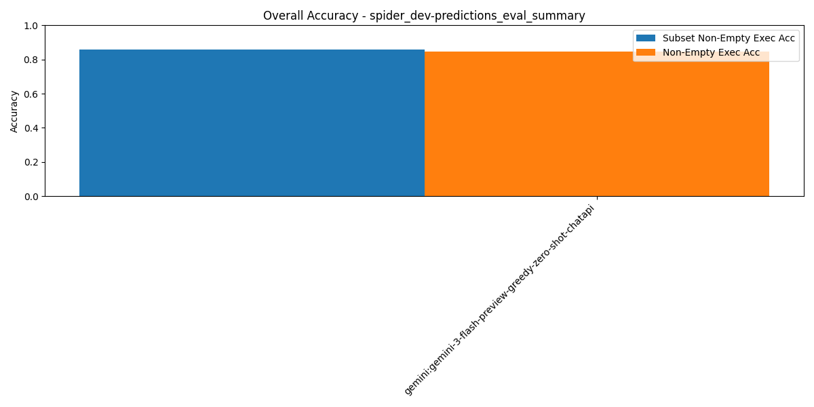

# Summary Results

## Overall Multi-Model Accuracy Results

_Results sorted by `subset_non_empty_execution_accuracy` (higher is better)_

| Rank | Model / Pipeline | Execution Acc | Non-Empty Exec Acc | Subset Non-Empty Exec Acc | BIRD Exec Acc | LLM Judge Score | Parsable SQL | SQL Syntactic Match | Eval Err | DF Err | Avg Tokens/Q | Avg Inference (ms) | Avg Execution (ms) | Total Tokens | Total Inference (ms) | Total Execution (ms) | #Records | #Predictions | #Evaluated | #Correct Non-Empty Exec Acc | #Correct Subset Non-Empty Exec Acc | #Correct As Per LLM Judge |
| --- | --- | --- | --- | --- | --- | --- | --- | --- | --- | --- | --- | --- | --- | --- | --- | --- | --- | --- | --- | --- | --- | --- |
| 1 | gemini:gemini-3-flash-preview-greedy-zero-shot-chatapi | 0.88 | 0.84 | 0.85 | 0.86 | N/A | 0.99 | 0.53 | 0.00 | 0.00 | 1919.28 | 5211.95 | 195.41 | 1984533 | 5389159.41 | 202057.66 | 1034 | 1032 | 1021 | 865 | 876 | N/A |
| 2 | wxai:meta-llama/llama-3-3-70b-instruct-greedy-zero-shot-chatapi | 0.82 | 0.78 | 0.79 | 0.79 | 0.97 | 1.00 | 0.27 | 0.00 | 0.01 | 1060.21 | 1699.00 | 53.02 | 1096253 | 1756763.6 | 54824.28 | 1034 | 1034 | 1034 | 805 | 820 | 1003 |
| 3 | wxai:meta-llama/llama-4-maverick-17b-128e-instruct-fp8-greedy-zero-shot-chatapi | 0.82 | 0.78 | 0.79 | 0.79 | 0.97 | 1.00 | 0.29 | 0.00 | 0.00 | 1054.71 | 1358.10 | 52.66 | 1090565 | 1404280.11 | 54455.43 | 1034 | 1034 | 1034 | 803 | 814 | 1008 |
| 4 | wxai:openai/gpt-oss-120b-greedy-zero-shot-chatapi | 0.80 | 0.76 | 0.78 | 0.77 | 0.98 | 1.00 | 0.31 | 0.00 | 0.00 | 1237.59 | 2248.10 | 57.08 | 1279670 | 2324531.4 | 59025.86 | 1034 | 1034 | 1034 | 791 | 808 | 1017 |
| 5 | wxai:openai/gpt-oss-120b-agentic-baseline4-3attempts | 0.73 | 0.72 | 0.78 | 0.69 | 0.97 | 1.00 | 0.28 | 0.00 | 0.01 | 3679.25 | 48985.67 | 21396.45 | 3804346 | 50651186.67 | 22123930.73 | 1034 | 1034 | 1031 | 744 | 808 | 1004 |
| 6 | wxai:openai/gpt-oss-120b-agentic-baseline1-3attempts | 0.79 | 0.76 | 0.78 | 0.76 | 0.98 | 1.00 | 0.30 | 0.00 | 0.00 | 1238.58 | 2365.03 | 6.65 | 1280691 | 2445442.6 | 6871.91 | 1034 | 1034 | 1034 | 783 | 802 | 1011 |
| 7 | wxai:openai/gpt-oss-120b-agentic-baseline2-3attempts | 0.79 | 0.76 | 0.77 | 0.76 | 0.98 | 1.00 | 0.30 | 0.00 | 0.00 | 1240.12 | 2443.20 | 6.25 | 1282283 | 2526264.48 | 6461.18 | 1034 | 1034 | 1034 | 784 | 801 | 1011 |
| 8 | wxai:openai/gpt-oss-120b-agentic-baseline0-3attempts | 0.74 | 0.72 | 0.77 | 0.71 | 0.97 | 1.00 | 0.23 | 0.00 | 0.00 | 1311.64 | 2593.13 | 6.96 | 1356238 | 2681300.95 | 7199.96 | 1034 | 1034 | 1034 | 741 | 795 | 1006 |
| 9 | wxai:ibm/granite-4-h-small-greedy-zero-shot-chatapi | 0.77 | 0.73 | 0.74 | 0.74 | 0.94 | 1.00 | 0.31 | 0.00 | 0.02 | 1039.17 | 2784.63 | 55.64 | 1074502 | 2879307.84 | 57531.82 | 1034 | 1034 | 1034 | 756 | 766 | 971 |
| 10 | wxai:openai/gpt-oss-120b-agentic-baseline5-3attempts | 0.72 | 0.71 | 0.72 | 0.69 | 0.89 | 0.96 | 0.27 | 0.00 | 0.02 | 9705.32 | 88533.30 | 10158.31 | 10035304 | 91543429.76 | 10503695.47 | 1034 | 1034 | 989 | 736 | 747 | 921 |
| 11 | wxai:openai/gpt-oss-120b-agentic-baseline3-3attempts | 0.01 | 0.01 | 0.01 | 0.01 | 0.02 | 1.00 | 0.24 | 0.00 | 0.98 | 4322.56 | 26326.43 | 8.00 | 4469525 | 27221528.69 | 8271.72 | 1034 | 1034 | 1034 | 9 | 10 | 20 |

