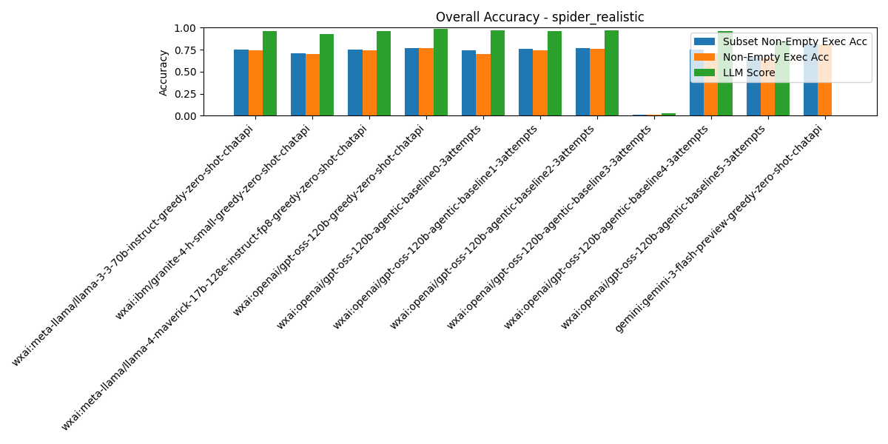

# Summary Results

## Overall Multi-Model Accuracy Results

_Results sorted by `subset_non_empty_execution_accuracy` (higher is better)_

| Rank | Model / Pipeline | Execution Acc | Non-Empty Exec Acc | Subset Non-Empty Exec Acc | BIRD Exec Acc | LLM Judge Score | Parsable SQL | SQL Syntactic Match | Eval Err | DF Err | Avg Tokens/Q | Avg Inference (ms) | Avg Execution (ms) | Total Tokens | Total Inference (ms) | Total Execution (ms) | #Records | #Predictions | #Evaluated | #Correct Non-Empty Exec Acc | #Correct Subset Non-Empty Exec Acc | #Correct As Per LLM Judge |
| --- | --- | --- | --- | --- | --- | --- | --- | --- | --- | --- | --- | --- | --- | --- | --- | --- | --- | --- | --- | --- | --- | --- |
| 1 | gemini:gemini-3-flash-preview-greedy-zero-shot-chatapi | 0.86 | 0.81 | 0.82 | 0.85 | N/A | 0.99 | 0.41 | 0.00 | 0.00 | 1926.72 | 5789.72 | 222.64 | 978773 | 2941176.95 | 113100.71 | 508 | 508 | 504 | 411 | 416 | N/A |
| 2 | wxai:openai/gpt-oss-120b-greedy-zero-shot-chatapi | 0.81 | 0.76 | 0.77 | 0.80 | 0.99 | 1.00 | 0.20 | 0.00 | 0.00 | 1189.76 | 2590.36 | 47.42 | 604397 | 1315902.42 | 24091.46 | 508 | 508 | 508 | 388 | 392 | 502 |
| 3 | wxai:openai/gpt-oss-120b-agentic-baseline2-3attempts | 0.81 | 0.76 | 0.77 | 0.79 | 0.97 | 1.00 | 0.21 | 0.00 | 0.00 | 1200.01 | 2441.16 | 7.62 | 609607 | 1240108.69 | 3873.02 | 508 | 508 | 508 | 384 | 390 | 493 |
| 4 | wxai:openai/gpt-oss-120b-agentic-baseline1-3attempts | 0.79 | 0.74 | 0.76 | 0.79 | 0.96 | 1.00 | 0.21 | 0.00 | 0.00 | 1193.89 | 2282.72 | 7.86 | 606495 | 1159623.6 | 3991.3 | 508 | 508 | 508 | 378 | 384 | 489 |
| 5 | wxai:meta-llama/llama-4-maverick-17b-128e-instruct-fp8-greedy-zero-shot-chatapi | 0.80 | 0.74 | 0.75 | 0.79 | 0.96 | 1.00 | 0.21 | 0.00 | 0.01 | 1000.40 | 1686.43 | 48.16 | 508202 | 856708.72 | 24465.47 | 508 | 508 | 508 | 378 | 383 | 489 |
| 6 | wxai:meta-llama/llama-3-3-70b-instruct-greedy-zero-shot-chatapi | 0.80 | 0.74 | 0.75 | 0.78 | 0.96 | 1.00 | 0.24 | 0.00 | 0.01 | 1001.18 | 2035.21 | 44.32 | 508598 | 1033885.48 | 22516.39 | 508 | 508 | 508 | 376 | 380 | 489 |
| 7 | wxai:openai/gpt-oss-120b-agentic-baseline4-3attempts | 0.73 | 0.71 | 0.75 | 0.70 | 0.96 | 1.00 | 0.19 | 0.00 | 0.01 | 3612.94 | 47224.40 | 19251.26 | 1835371 | 23989995.71 | 9779637.87 | 508 | 508 | 507 | 362 | 380 | 489 |
| 8 | wxai:openai/gpt-oss-120b-agentic-baseline0-3attempts | 0.75 | 0.70 | 0.74 | 0.74 | 0.97 | 1.00 | 0.15 | 0.00 | 0.00 | 1259.59 | 2374.40 | 7.99 | 639872 | 1206196.4 | 4060.69 | 508 | 508 | 508 | 355 | 376 | 493 |
| 9 | wxai:ibm/granite-4-h-small-greedy-zero-shot-chatapi | 0.75 | 0.70 | 0.71 | 0.74 | 0.93 | 1.00 | 0.21 | 0.00 | 0.03 | 978.02 | 2924.83 | 46.05 | 496833 | 1485813.85 | 23394.52 | 508 | 508 | 508 | 357 | 359 | 472 |
| 10 | wxai:openai/gpt-oss-120b-agentic-baseline5-3attempts | 0.68 | 0.66 | 0.67 | 0.66 | 0.84 | 0.95 | 0.18 | 0.00 | 0.04 | 9532.59 | 91403.42 | 10628.44 | 4842557 | 46432939.15 | 5399245.33 | 508 | 508 | 482 | 335 | 338 | 428 |
| 11 | wxai:openai/gpt-oss-120b-agentic-baseline3-3attempts | 0.02 | 0.02 | 0.02 | 0.02 | 0.03 | 1.00 | 0.18 | 0.00 | 0.97 | 4177.23 | 25118.63 | 21.17 | 2122034 | 12760265.9 | 10752.05 | 508 | 508 | 508 | 8 | 8 | 13 |

